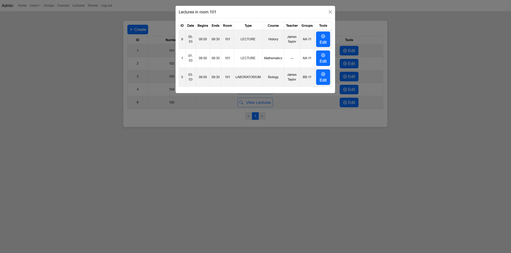
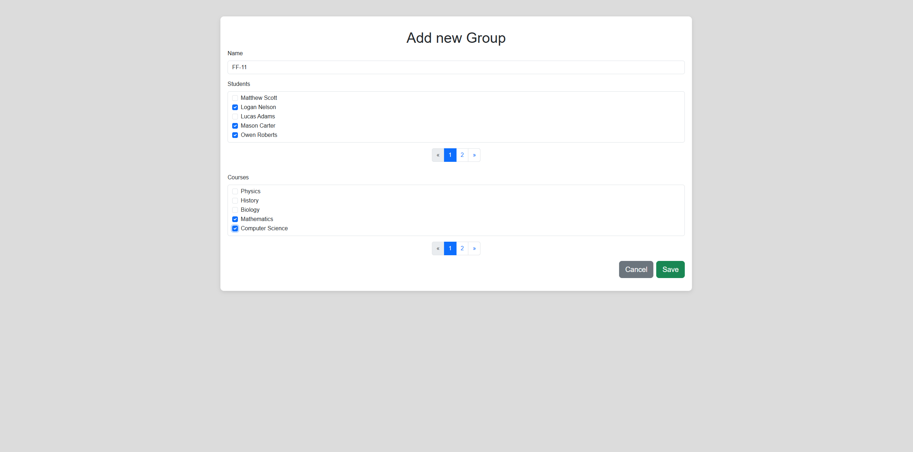
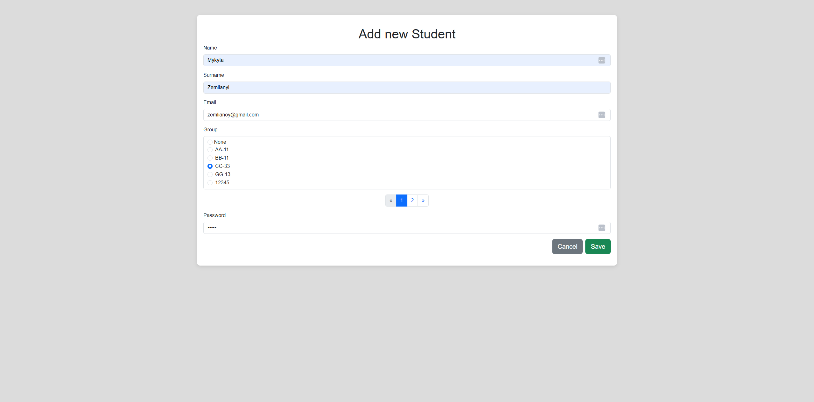

# University CMS

**University CMS** is a web-based content management system designed to simplify and centralize the management of educational entities such as administrators, students, teachers, courses, groups, lectures, and rooms.

## 📌 Project Overview

University CMS is an extensible and user-friendly platform built for small educational centers, online academies, or institutions looking for a customizable foundation to manage academic operations. It provides a robust administration panel with rich functionality and user role segregation.

## 🚀 Features

- Admin dashboard with full CRUD operations for:
  - Users (Admins, Teachers, Students)
  - Courses, Groups, Lectures, Classrooms
- Dynamic pagination select and multi-select fields (JS + jQuery) for entity associations
- Pagination and modals for improved UX
- Form validation with user-friendly error feedback
- Spring Security role-based access control:
  - **Admin**: Full access
  - **Teacher**: View access to students, lectures, courses
  - **Student**: View access to courses, teachers, groups, lectures
- Error handling
- Clean and maintainable codebase

---

## 🛠️ Tech Stack

- **Backend**: Java, Spring Boot, Spring Security, Spring Web MVC, Spring Data JPA
- **Database**: PostgreSQL
- **Frontend**: Thymeleaf, Bootstrap, HTML, CSS, JavaScript, jQuery
- **Build & Tools**: Maven, Flyway, Docker Compose, webJars
- **Testing**: JUnit 5, Mockito, Testcontainers
- **IDE**: Eclipse

---
## 🧪 Testing
- 261 unit and integration tests written with JUnit 5, Mockito, and Testcontainers
- Over 92% test coverage
- Use Docker to provide a clean PostgreSQL instance for integration testing

---

## 🔒 Security
- Built-in Spring Security
- Role-based access control (Admin, Teacher, Student)
- Login form with validation and error handling

---

## 🖼️ Screenshots

Rooms List — Shows modal with lectures



Group Creation Form — Includes dynamic multi-select for students and courses



Student Creation Form — Includes dynamic group selection field



---

## 🔮 Future Features
1. Full-featured timetable interface for students and teachers
2. CI/CD setup via GitHub Actions or GitLab CI

## ⚙️ Installation & Setup

### ✅ Prerequisites

- Java 17+
- Maven 3.8+
- PostgreSQL
- Docker (for tests)

---

### 🧱 Build

1. Clone the repository:
```bash
git clone <your-repo-url>
cd university-cms
```
2. Build the project using Maven:

```bash
mvn clean install spring-boot:repackage
```
3. Run the JAR file from the terminal
```bash
java -jar target/university-cms.jar
```